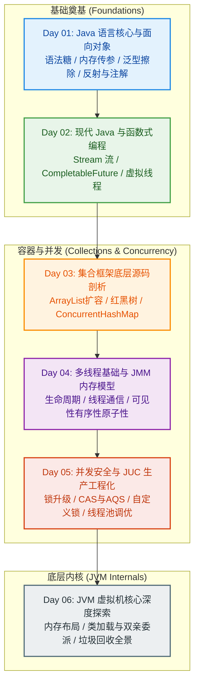
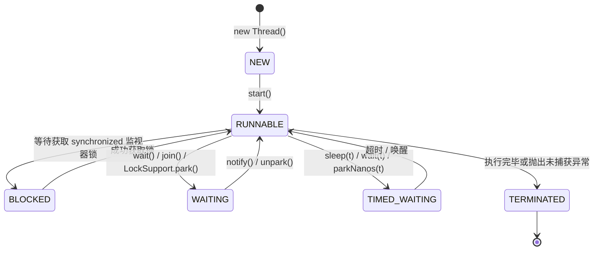
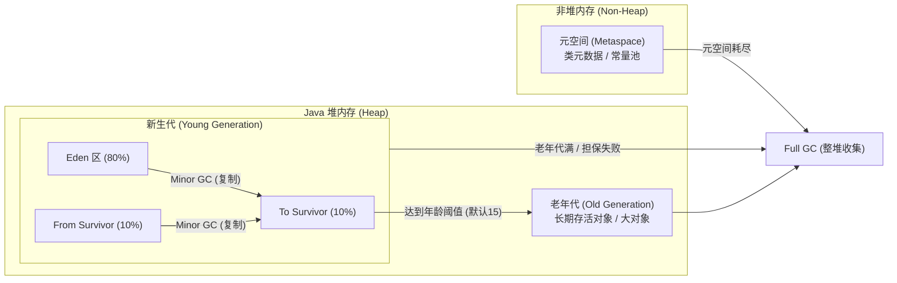

<div align="center">

# Java Interview Master

### 一线大厂高频核心技术点全景剖析与可运行实战代码库
### Comprehensive, Runnable & Production-Grade Java Interview Architecture

[](https://www.oracle.com/java/)
[](https://github.com/LinSky-J/javacode)
[](https://github.com/LinSky-J/javacode)
[](https://github.com/LinSky-J/javacode)
[](https://github.com/LinSky-J/javacode)
[](LICENSE)

<br/>

**[ 中文文档 ](#chinese-version)** &nbsp;&nbsp;|&nbsp;&nbsp; **[ English Documentation ](#english-version)** &nbsp;&nbsp;|&nbsp;&nbsp; **[ 路线导图 / Roadmap ](#roadmap)** &nbsp;&nbsp;|&nbsp;&nbsp; **[ 快速开始 / Quick Start ](#quick-start)**

</div>

---

<a name="roadmap"></a>
## 架构路线导图 / Architecture Roadmap



---

<a name="chinese-version"></a>
# 中文文档

## 一、项目设计理念与定位

> [!NOTE]
> 本项目并非简单的面试八股文摘要，而是一套**基于真实代码执行推导、直击底层字节码与操作系统交互**的完整 Java 高频技术攻坚体系。

- **问题导向**：每一个包、每一个类都直接绑定具体大厂面试原题，回答直截了当。
- **验证为王**：全工程 150+ 个类均自带独立的 `main` 方法，支持一键在 IDEA 中运行验证。
- **源码级剖析**：不仅讲解“是什么”，更通过手写实现（如手写 AQS 公平锁、手写打破双亲委派类加载器、模拟卡表与 Region 划分）讲解“为什么”。
- **严谨工程风格**：全工程严格规范命名，代码、注释与控制台输出完全杜绝任何 emoji 字符，保障生产级技术严谨度。

---

## 二、六大核心模块深度详解

### Day 01: Java 语言核心基础与面向对象机制

| 分类目录 | 对应核心面试考点 | 深度解析与实战类 |
| :--- | :--- | :--- |
| `basics/` | Java 核心特性、优缺点全景、Java 与 Python 全维度对比 | [JavaFeaturesAndProsCons.java](file:///e:/java/Java%20interview/day01/basics/JavaFeaturesAndProsCons.java) |
| `execution/` | 编译型与解释型异同、一次编写到处运行的 JVM 跨平台本质 | [JavaCrossPlatformPrinciple.java](file:///e:/java/Java%20interview/day01/execution/JavaCrossPlatformPrinciple.java) |
| `jvm/` | JVM、JRE 与 JDK 边界划分与体系全貌 | [JvmConceptAndJdkJreRelationship.java](file:///e:/java/Java%20interview/day01/jvm/JvmConceptAndJdkJreRelationship.java) |
| `datatypes/` | 基本数据类型隐式转换、自动拆装箱底层字节码与 IntegerCache 陷阱 | [JavaIntegerAndBoxingMechanism.java](file:///e:/java/Java%20interview/day01/datatypes/JavaIntegerAndBoxingMechanism.java) |
| `parameters/` | Java 参数传递本质（值传递图解与对象地址操作证明） | [JavaValueTransferMechanism.java](file:///e:/java/Java%20interview/day01/parameters/JavaValueTransferMechanism.java) |
| `oop/` | 面向对象三大特性、抽象类 vs 接口、静态嵌套类与内部类 | [OopFeaturesAndPolymorphism.java](file:///e:/java/Java%20interview/day01/oop/features/OopFeaturesAndPolymorphism.java) |
| `keywords/` | `static` 内存分配时机、`final` 内存不可变性与安全性 | [JavaFinalKeywordMechanism.java](file:///e:/java/Java%20interview/day01/keywords/finalkeyword/JavaFinalKeywordMechanism.java) |
| `strings/` | String 不可变性设计哲学、StringBuilder 与 StringBuffer 扩容比较 | [StringAndBufferBuilderComparison.java](file:///e:/java/Java%20interview/day01/strings/StringAndBufferBuilderComparison.java) |
| `objects/` | `equals` 与 `hashCode` 契约规范、哈希碰撞与对象比较避坑 | [ObjectMethodsAndComparisonExplanation.java](file:///e:/java/Java%20interview/day01/objects/methods/ObjectMethodsAndComparisonExplanation.java) |
| `copy/` | 浅拷贝与深拷贝三种实现途径对比（Cloneable/序列化/工具类） | [ShallowVsDeepCopyComparison.java](file:///e:/java/Java%20interview/day01/copy/ShallowVsDeepCopyComparison.java) |
| `generics/` | 泛型类型擦除底层机理（Type Erasure）、桥接方法与通用 CRUD | [JavaGenericsConceptAndErasure.java](file:///e:/java/Java%20interview/day01/generics/JavaGenericsConceptAndErasure.java) |
| `reflection/` | 反射底层实现机制、私有属性穿透调用与性能损耗规避 | [JavaReflectionMechanismAndUsage.java](file:///e:/java/Java%20interview/day01/reflection/JavaReflectionMechanismAndUsage.java) |
| `annotations/` | 自定义注解定义、元注解体系与运行时反射解析框架实战 | [JavaAnnotationPrincipleAndParsing.java](file:///e:/java/Java%20interview/day01/annotations/JavaAnnotationPrincipleAndParsing.java) |
| `exceptions/` | 异常继承树（Throwable/Exception/Error）、受检异常与 finally 顺序 | [JavaExceptionHierarchyAndHandling.java](file:///e:/java/Java%20interview/day01/exceptions/JavaExceptionHierarchyAndHandling.java) |

---

### Day 02: 现代 Java 进阶特性与异步函数式编程

| 分类目录 | 对应核心面试考点 | 深度解析与实战类 |
| :--- | :--- | :--- |
| `java8/` | Lambda 表达式原理、函数式接口四大核心、接口默认方法与静态方法 | [Java8FeaturesAndLambdaExplanation.java](file:///e:/java/Java%20interview/day02/java8/Java8FeaturesAndLambdaExplanation.java) |
| `stream/` | Stream 流惰性求值、常用算子（filter/map/flatMap/reduce）与性能基准 | [StreamApiOperationsAndPrinciples.java](file:///e:/java/Java%20interview/day02/stream/StreamApiOperationsAndPrinciples.java) |
| `async/` | CompletableFuture 异步编排、任务合并、异常降级与多源并行拉取 | [CompletableFutureUsageExplanation.java](file:///e:/java/Java%20interview/day02/async/CompletableFutureUsageExplanation.java) |
| `java21/` | Java 21 虚拟线程（Virtual Thread）底层调度、载体线程与并发性能对比 | [VirtualThreadArchitecture.java](file:///e:/java/Java%20interview/day02/java21/VirtualThreadArchitecture.java) |
| `serialization/` | Java 原生序列化、`serialVersionUID` 一致性与敏感字段 transient 保护 | [JavaSerializationPrinciplesAndSecurity.java](file:///e:/java/Java%20interview/day02/serialization/JavaSerializationPrinciplesAndSecurity.java) |
| `other/` | JNI 本地方法栈与操作系统底层 C/C++ 交互通信机制 | [OtherQuestionsExplanation.java](file:///e:/java/Java%20interview/day02/other/OtherQuestionsExplanation.java) |

---

### Day 03: Java 集合框架底层源码深度剖析

| 集合体系 | 核心考点与设计精髓 | 深度解析与实战类 |
| :--- | :--- | :--- |
| **Concept** | Collection 顶层架构设计、List/Set/Queue/Map 分类体系与遍历策略 | [JavaCollectionArchitecture.java](file:///e:/java/Java%20interview/day03/concept/JavaCollectionArchitecture.java) |
| **List 专题** | • ArrayList 动态扩容机制（1.5 倍）与线程安全转换方案<br/>• 多线程并发下 ArrayList 的 `add()` 数据丢失与数组越界底层复现<br/>• CopyOnWriteArrayList 读写分离写时复制机制及适用场景<br/>• `Arrays.asList` 陷阱与泛型转换深度剖析 | [ListImplementationsComparison.java](file:///e:/java/Java%20interview/day03/list/ListImplementationsComparison.java)<br/>[ArrayListInternalsAndGrowth.java](file:///e:/java/Java%20interview/day03/list/ArrayListInternalsAndGrowth.java)<br/>[ArrayListConcurrencyUnsafeDemo.java](file:///e:/java/Java%20interview/day03/list/ArrayListConcurrencyUnsafeDemo.java)<br/>[CopyOnWriteArrayListDeepDive.java](file:///e:/java/Java%20interview/day03/list/CopyOnWriteArrayListDeepDive.java) |
| **Set 专题** | • List 与 Set 核心区别、HashSet 底层基于 HashMap 的键去重机制<br/>• 维持插入顺序的 LinkedHashSet 与基于红黑树的 TreeSet 排序机制<br/>• 重写 equals 未重写 hashCode 引发的哈希集合内存泄漏与检索失效演示 | [SetCharacteristicsAndDeduplication.java](file:///e:/java/Java%20interview/day03/set/SetCharacteristicsAndDeduplication.java)<br/>[SetSortingAndOrderingDemo.java](file:///e:/java/Java%20interview/day03/set/SetSortingAndOrderingDemo.java)<br/>[EqualsAndHashCodeContractInSet.java](file:///e:/java/Java%20interview/day03/set/EqualsAndHashCodeContractInSet.java) |
| **Map 专题** | • HashMap 数组 + 单链表 + 红黑树结构演进与红黑树 vs AVL 树选型考量<br/>• put 与 get 完整执行流程及高低位异或扰动函数<br/>• 为什么容量必须是 2 的 n 次方？扩容机制与多线程并发安全隐患<br/>• HashTable 与 ConcurrentHashMap 的实现演进（分段锁 -> CAS + synchronized） | [HashMapInternalsAndPutGetFlow.java](file:///e:/java/Java%20interview/day03/map/HashMapInternalsAndPutGetFlow.java)<br/>[HashMapRedBlackTreeVsAvlExplanation.java](file:///e:/java/Java%20interview/day03/map/HashMapRedBlackTreeVsAvlExplanation.java)<br/>[HashMapResizeAndCapacityMechanism.java](file:///e:/java/Java%20interview/day03/map/HashMapResizeAndCapacityMechanism.java)<br/>[HashTableVsConcurrentHashMapDeepDive.java](file:///e:/java/Java%20interview/day03/map/HashTableVsConcurrentHashMapDeepDive.java) |

---

### Day 04: Java 多线程基础与 JMM 内存模型



- **`model/`**: Java 线程与操作系统的内核级线程（1:1 模型）映射机制、用户态与内核态切换开销。
- **`creation/`**: 线程创建的四种方式及为何不建议继承 `Thread` 类的解耦设计。
- **`lifecycle/`**: 线程六大生命周期状态机精准流转、BLOCKED 与 WAITING 状态细致差异。
- **`interrupt/`**: 协作式中断机制（`interrupt`、`isInterrupted`、`interrupted`）与优雅停机最佳实践。
- **`waitnotify/`**: `wait()` 与 `notify()` 底层 ObjectMonitor 机制与虚假唤醒（Spurious Wakeup）防护。
- **`communication/`**: 线程间通信模式（共享内存、管道流动、条件队列 Condition）。
- **`jmm/`**: Java 内存模型主内存与工作内存交互、可见性/有序性/原子性三大特性及 Happens-Before 规则详解。

---

### Day 05: 并发安全体系、JUC 核心工具与线程池工程化

> [!IMPORTANT]
> 并发安全核心模块包含手写可重入公平锁、死锁排查与线上线程池动态调优实战，是高并发架构面试的核心拉分项。

- **`concurrentsafety/` (锁机制与底层原子操作)**:
  - **Volatile**: 内存可见性语义、禁止指令重排序、四种内存屏障与双重检查锁定（DCL）单例。
  - **Synchronized 锁升级**: Mark Word 64 位结构演进（无锁 -> 偏向锁 -> 轻量级锁 -> 重量级锁）。
  - **锁分类图谱**: 乐观锁与悲观锁、公平锁与非公平锁、读写锁与自旋锁。
  - **CAS 与 Unsafe**: 硬件级原子指令、ABA 问题与 `AtomicStampedReference` 版本戳解决方案。
  - **AQS 核心架构**: State 状态变量、双向 CLH 同步队列变种，手写实现自定义可重入公平锁。
- **`multithread/` (JUC 工具与死锁防控)**:
  - 死锁产生的四个必要条件与破坏方案（基于 `Lock.tryLock()` 超时规避死锁）。
  - `ThreadLocal` 底层原理、ThreadLocalMap 弱引用机制与内存泄漏排查（`remove()` 规范）。
  - JUC 核心协作工具：`CountDownLatch`、`CyclicBarrier`、`Semaphore`。
- **`threadpool/` (线程池工程化实战)**:
  - 线程池核心七大参数详解与任务提交调度流水线。
  - 四种系统内置拒绝策略与自定义告警/降级拒绝策略实战。
  - CPU 密集型与 IO 密集型线程池容量理论估算与生产动态调优方案。

---

### Day 06: JVM 虚拟机深度探秘（内存结构、类加载与垃圾回收）



- **`memory/` (JVM 运行时数据区与故障排查)**:
  - 五大运行时数据区（程序计数器、虚拟机栈、本地方法栈、堆、方法区/元空间）。
  - 栈帧内部结构（局部变量表、操作数栈、动态链接、方法返回地址）。
  - 堆分代结构演进、对象分配规则与大对象直接进老年代。
  - 字符串常量池机制、`String s = new String("abc")` 内存分配过程与 `intern()` 剖析。
  - 强引用、软引用、弱引用、虚引用深度对比与 `WeakHashMap` 典型应用。
  - 内存泄漏与内存溢出（OOM）实战复现、排查工具（MAT、JProfiler、VisualVM）与排查步骤。
- **`classloading/` (类加载过程与双亲委派机制)**:
  - 对象创建的六大详细流程与完整生命周期（加载 -> 验证 -> 准备 -> 解析 -> 初始化 -> 使用 -> 卸载）。
  - 类加载器层级（Bootstrap -> Extension/Platform -> Application -> Custom）。
  - 双亲委派模型定义、三大核心价值（安全性、一致性、避免重复加载）。
  - 破坏双亲委派机制的典型场景（SPI 机制、OSGi、Tomcat 隔离）与手写打破双亲委派的自定义 ClassLoader。
- **`gc/` (垃圾回收机制与算法全解)**:
  - 垃圾回收定义与自动/手动触发条件；
  - 垃圾判别方法：引用计数法缺陷 vs 可达性分析法及对象自救机制；
  - 垃圾回收核心算法：标记-清除、标记-复制、标记-整理、分代收集、分区算法；
  - 标记清除算法的致命缺陷（碎片化与效率不稳定）；
  - GC 哪些阶段会 Stop The World (STW)？
  - Minor GC、Major GC、Full GC 核心区别与 Full GC 触发的六大场景；
  - 垃圾收集器全景图谱（Serial、Parallel、CMS、G1、ZGC、Shenandoah）；
  - CMS 与 G1 的六大维度深度对比及选型指南；
  - G1 回收器的七大核心特色（Region、垃圾优先、停顿预测模型、SATB等）；
  - GC 的回收范围（不仅是堆，方法区/元空间的废弃常量与类卸载）。

---

<a name="english-version"></a>
# English Documentation

## 1. Architectural Vision & Principles

> [!NOTE]
> This repository is not merely an interview preparation cheat-sheet, but an **empirically validated, production-grade Java architecture learning suite** grounded in source-level execution and OS-level interactions.

- **Question-Centric**: Every package and class directly targets genuine corporate interview questions.
- **Runnable Evidence**: All 150+ classes contain standalone `main` methods for immediate execution and tracing.
- **Source-Level Mastery**: Beyond theoretical answers, the repository demonstrates the underlying mechanics through hands-on implementations (e.g., custom fair locks via AQS, breaking parents delegation via custom classloaders, simulating card tables and G1 region calculations).
- **Engineering Rigor**: Zero emojis in all code, comments, and console outputs to preserve an authentic production-grade software standard.

---

## 2. Six Core Modules Overview

### Day 01: Core Java Foundations & OOP Mechanics
Deconstructs language execution, typing rules, and core design principles:
- **Language Fundamentals**: Differences between compiled and interpreted languages, JRE/JDK boundaries, pass-by-value proof.
- **Object-Oriented Design**: Encapsulation, inheritance, polymorphism, abstract classes vs interfaces, static nested classes.
- **Key Concepts**: `static` and `final` immutability, String pooling and mutable buffers, `equals`/`hashCode` contract violations.
- **Advanced Mechanics**: Generics type erasure, reflection performance optimization, custom annotation reflection framework, and exception hierarchy execution flow.

### Day 02: Modern Java & Asynchronous Functional Programming
Focuses on long-term support releases (Java 8 LTS & Java 21 LTS):
- **Functional Programming**: Lambda syntax mechanics, the four core functional interfaces, and default methods.
- **Stream API**: Stream pipelines, lazy evaluation, benchmark comparisons.
- **Asynchronous Orchestration**: `CompletableFuture` task composition, parallel data joins, and error fallback handlers.
- **Next-Gen Concurrency**: Java 21 Virtual Threads architecture, carrier thread scheduling, and throughput under heavy concurrent loads.

### Day 03: Java Collections Framework Source Code Deep Dive
Comprehensive study of collections data structures, resizing mechanics, and concurrent safety:
- **List Implementations**: ArrayList internal array growth (1.5x), thread-safe wrappers, multi-threaded lost updates, and `CopyOnWriteArrayList` copy-on-write snapshot mechanics.
- **Set Implementations**: HashSet deduplication via HashMap `putVal`, `LinkedHashSet` insertion ordering, `TreeSet` Red-Black tree sorting, and memory leaks when omitting `hashCode`.
- **Map Internals**: HashMap treeification (Red-Black tree vs AVL), bitwise hash spread algorithms, power-of-two table sizing, multi-threaded race conditions, and `ConcurrentHashMap` evolution from Segment locking to CAS + synchronized.

### Day 04: Multithreading Fundamentals & Java Memory Model (JMM)
Unravels thread lifecycles, coordination mechanisms, and hardware-level memory visibility:
- **Thread Mechanics**: OS kernel thread mapping (1:1 model), 4 creation methods, and 6-state state machine.
- **Cooperative Interruption**: `interrupt()`, `isInterrupted()`, and `interrupted()` graceful teardown protocols.
- **Inter-Thread Communication**: ObjectMonitor wait/notify protocols, preventing spurious wakeups, and Condition wait-queues.
- **JMM Specification**: Main memory vs working memory, Visibility, Ordering, Atomicity, and Happens-Before rules.

### Day 05: Concurrency Safety, JUC Utilities & ThreadPool Engineering
Mastery of synchronization, lock escalation, lock-free concurrency, and industrial thread pool management:
- **Locking & Primitives**: `volatile` memory barriers, `synchronized` lock escalation (No lock -> Biased -> Lightweight -> Heavyweight), optimistic vs pessimistic locking, and CAS ABA resolution via `AtomicStampedReference`.
- **AQS Architecture**: Synchronization state, CLH queue variants, and writing a custom fair reentrant lock from scratch.
- **Multithreading Utilities**: Deadlock conditions and avoidance via `Lock.tryLock()`, ThreadLocal memory leak prevention, CountDownLatch, CyclicBarrier, and Semaphore.
- **ThreadPool Executor**: 7 core parameters, task scheduling flow, default rejection policies, custom alerting/persistence policies, and formula-based sizing for CPU vs IO workloads.

### Day 06: JVM Deep Dive (Memory Layout, Class Loading & Garbage Collection)
Deconstructing virtual machine internals from bytecode execution to GC:
- **JVM Memory Areas**: 5 runtime data areas, stack frames, heap generational structures, and method area/metaspace evolution.
- **Object Allocations & Leaks**: String constant pool allocation mechanics, strong/soft/weak/phantom reference taxonomy, and diagnosing OOM via MAT/JProfiler.
- **Class Loading & Delegation**: 6-stage object lifecycle, ClassLoader hierarchy, Parents Delegation model, and custom ClassLoaders breaking delegation for container isolation.
- **Garbage Collection Mastery**: Liveness detection (Reference counting flaws vs Reachability analysis), GC algorithms (Mark-Sweep, Mark-Copy, Mark-Compact, Generational, Region-based), STW phases, Minor vs Major vs Full GC, Full GC triggers, and comprehensive comparison of CMS vs G1 collectors.

---

<a name="quick-start"></a>
## 三、快速开始 / Quick Start

### 1. 环境准备 / Prerequisites

- **JDK**: JDK 17 或 JDK 21 LTS (推荐 JDK 21，向前兼容 Java 8 核心语法) / JDK 17 or JDK 21 LTS recommended.
- **IDE**: IntelliJ IDEA 2023.1+ / VS Code.
- **Encoding**: 统一 UTF-8 编码 / UTF-8 character encoding throughout.

### 2. 克隆仓库与运行 / Clone & Execute

```bash
# 1. 克隆本仓库 / Clone repository
git clone https://github.com/LinSky-J/javacode.git

# 2. 进入项目根目录 / Navigate to project root
cd "Java interview"

# 3. 命令行验证全量编译 / Verify full compilation via CLI
javac -encoding UTF-8 day06/gc/GarbageCollectionInterviewMasterSummary.java
java -Dfile.encoding=UTF-8 -cp . gc.GarbageCollectionInterviewMasterSummary
```

在 IntelliJ IDEA 中，只需右键任意类名（例如 `day06/gc/GarbageCollectionInterviewMasterSummary.java`），点击 **Run** 即可在控制台直接查看结构化输出与深度推导日志。

---

## 四、项目完整源码目录树 / Repository File Tree

```text
Java interview/
├── README.md                      # 中英文双语技术全景说明文档 (Bilingual Tech Specs)
├── day01/                         # Java 核心基础与面向对象机制 (Core Foundations & OOP)
│   ├── annotations/               # 自定义注解与运行时解析框架
│   ├── basics/                    # 语言特性与 Java vs Python 全维度对比
│   ├── copy/                      # 浅拷贝 vs 深拷贝实现机制
│   ├── datatypes/                 # 基本数据类型与包装类缓存机制
│   ├── exceptions/                # 异常体系结构与 try-catch 字节码流转
│   ├── execution/                 # 跨平台运行机制与解释/编译混合执行
│   ├── generics/                  # 泛型设计与类型擦除底层机制
│   ├── jvm/                       # JVM/JRE/JDK 架构全览
│   ├── keywords/                  # static 与 final 关键字底层机理
│   ├── objects/                   # Object 核心方法与 equals/hashCode 契约
│   ├── oop/                       # 面向对象三大特性、抽象类 vs 接口
│   ├── parameters/                # Java 参数传递机制（值传递图解）
│   ├── reflection/                # 反射机制原理与私有属性访问突破
│   └── strings/                   # String 不可变性与 StringBuilder 扩容
├── day02/                         # 现代 Java 特性与进阶 (Modern Java & Advanced)
│   ├── async/                     # CompletableFuture 异步流水线编排
│   ├── java21/                    # Java 21 虚拟线程 (Virtual Thread) 架构
│   ├── java8/                     # Lambda 表达式与函数式接口实战
│   ├── other/                     # JNI 本地方法与操作系统底层交互
│   ├── serialization/             # Java 序列化规范与 serialVersionUID 机制
│   └── stream/                    # Stream API 常用算子与惰性求值
├── day03/                         # 集合框架源码深度剖析 (Collections Framework)
│   ├── concept/                   # Collection 架构全览与遍历性能对比
│   ├── list/                      # ArrayList 扩容、并发安全与 CopyOnWriteArrayList
│   ├── map/                       # HashMap 源码、红黑树、扩容与 ConcurrentHashMap
│   └── set/                       # HashSet 去重机制、LinkedHashSet 与 TreeSet 排序
├── day04/                         # 多线程基础与 JMM 内存模型 (Multithreading & JMM)
│   ├── communication/             # 线程间通信模式（共享内存、管道、条件队列）
│   ├── creation/                  # 线程创建方式与设计权衡
│   ├── interrupt/                 # 协作式中断机制与优雅停机方案
│   ├── jmm/                       # JMM 内存模型、可见性、有序性与 Happens-Before
│   ├── lifecycle/                 # 线程六大生命周期状态机精准流转
│   ├── model/                     # 线程 1:1 内核映射模型与协程对比
│   ├── overview/                  # 并发编程阶段演进与面试总纲
│   └── waitnotify/                # ObjectMonitor 监视器与虚假唤醒防护
├── day05/                         # 并发安全与 JUC 实战 (Concurrency Safety & JUC)
│   ├── concurrentsafety/          # Volatile、锁升级、CAS/ABA 与手写 AQS 公平锁
│   ├── multithread/               # 死锁排查、ThreadLocal 内存泄漏与 JUC 工具类
│   └── threadpool/                # 线程池七大参数、自定义拒绝策略与动态容量调优
└── day06/                         # JVM 虚拟机深度探秘 (JVM Deep Dive)
    ├── classloading/              # 对象生命周期、类加载过程与打破双亲委派实战
    ├── gc/                        # 垃圾回收算法、STW 剖析、CMS vs G1、Full GC 触发场景
    └── memory/                    # 运行时数据区、堆结构、常量池、引用类型与 OOM 排查
```

---

<div align="center">

**Engineering Standard**: Zero Emojis &nbsp;|&nbsp; 100% Compilable &nbsp;|&nbsp; Production Grade

Designed and Maintained with Architectural Rigor.

</div>
